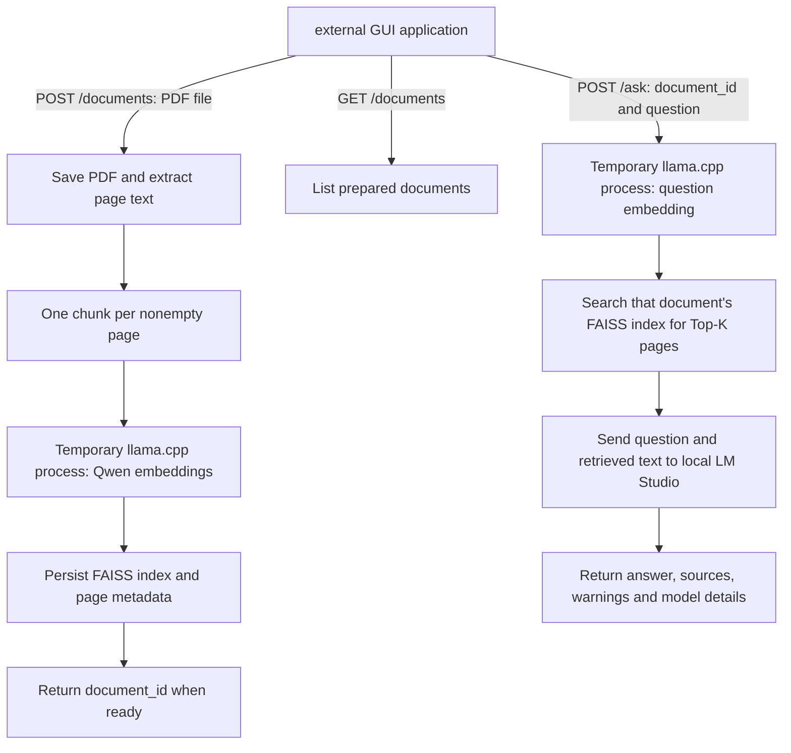

<table>
  <tr>
    <td>


    </td>
    <td>

# Ask The Book
A local, API-only RAG backend. Promptlet or another GUI consumes HTTP endpoints;
processing code stays here. Upload a text-based PDF, then ask questions about it and receive answers with retrieved page text and citations. 
    </td>
  </tr>
</table>

The pipeline is implemented directly in Python: PyMuPDF extracts text, external
llama.cpp runs Qwen3-Embedding-0.6B, CPU FAISS retrieves pages, and LM Studio runs
the answer model. FastAPI exposes the backend through Uvicorn. Embeddings use a local GGUF model.

## Server workflow



Uploading prepares a document once. Questions reuse its saved index; they do not
re-extract or re-embed the PDF. Each question searches one selected document.
PDF page numbers are one-based physical pages, which may differ from printed
page labels in the book.

You start and stop the AskTheBook server and LM Studio separately. AskTheBook
starts a temporary `llama-server.exe` (Windows, hidden) or `llama-server` (Linux) for each embedding operation, waits
for it to become ready, and stops it when that operation finishes or raises an
error. It releases its embedding process before requesting an answer from LM
Studio. It does not start, stop, or unload LM Studio's models. The tester only
makes HTTP requests; exiting it does not stop the server.

## Setup and start

The runtime supports Windows (`llama-server.exe`) and Linux (`llama-server`).
Local testing so far has used Windows and Python 3.13; Linux runtime validation
is still pending. Before running, provide:

- An unlocked PDF containing extractable text. Scanned image-only PDFs need OCR,
  which this project does not provide.
- An external llama.cpp binary distribution for your OS, extracted with its required
  shared libraries together. Point the configuration at its binary directory; no Python
  llama-cpp package or source build is required.
- A downloaded `Qwen3-Embedding-0.6B-f16.gguf` embedding model.
- LM Studio with a downloaded answer model and its local API server enabled.
  `google/gemma-3-4b` is the example default; another available model can be used.

Run these commands from the repository root. Install dependencies once:

```powershell
python -m venv .venv
.\.venv\Scripts\python.exe -m pip install -r requirements.txt
```

Edit `config.json` to set your external llama.cpp directory, Qwen GGUF,
and LM Studio URL/model. JSON paths can use forward slashes, for
example `D:/tools/llama.cpp/bin`. `rag_index_dir` is optional for a fresh setup;
omit it if you have no previously prepared index. Uploads use `documents_dir`.

Start LM Studio's local API before asking questions, then start AskTheBook:

```powershell
.\.venv\Scripts\python.exe -m src.api
```

Use `--config path/to/config.json` to select another configuration. The default
configuration is `config.json` at the repository root. Listing documents
does not require either model to be running; upload preparation needs Qwen, and
answering needs both the Qwen runtime and LM Studio.

The API defaults to http://127.0.0.1:8000. Leave it running and use the tester from
another terminal. Stop with Ctrl+C after requests finish. This version supports
loopback only, no authentication, and **one server process / one Uvicorn worker**.
Model downloads and dependency installation need internet access; inference does not.

## Run a downloaded executable

Download the package for your platform from this repository's **Releases** page.
Python is included; llama.cpp, the embedding model, and LM Studio must be installed
separately as described above.

### Windows

1. Extract `AskTheBook-windows-x64.zip` into a writable folder.
2. Edit the included `config.json` with your model and llama.cpp paths.
3. Keep `config.json` beside `AskTheBook.exe` and double-click the executable.
4. Leave the console open while using the API. Press Ctrl+C to stop the server.

If the console closes on startup, run `AskTheBook.exe` from PowerShell to read the
error. You can select another configuration with `--config C:/path/to/config.json`.

### Ubuntu

Extract `AskTheBook-ubuntu-22.04-x64.tar.gz` into a writable folder:

```bash
mkdir -p AskTheBook
tar -xzf AskTheBook-ubuntu-22.04-x64.tar.gz -C AskTheBook
cd AskTheBook
# Edit config.json with Linux paths before starting.
./AskTheBook
```

Use a Linux llama.cpp distribution containing an executable `llama-server`.
The package targets Ubuntu 22.04 x64; other distributions have not been verified.
Launch it from a terminal and press Ctrl+C to stop it.

For either platform, start LM Studio's local server before asking questions.
Relative data paths resolve from the folder containing `config.json`. Keep your
existing data in those locations when moving an installation.

## Tester

For a fresh installation, upload a PDF first. Its path is on the tester's machine;
the tester sends the file contents to the server:

```powershell
.\.venv\Scripts\python.exe -m tester documents
.\.venv\Scripts\python.exe -m tester add "data/raw/another-book.pdf"
.\.venv\Scripts\python.exe -m tester ask "What is the main topic?" --document DOCUMENT_ID --model google/gemma-3-4b --top-k 3
```

Replace DOCUMENT_ID with the ID returned by upload. PDFs can be anywhere on disk;
`data/raw` is only an example. Omitting `--model` and `--top-k` uses server defaults.
Prepared documents survive a server restart.

If you already have an index configured through `rag_index_dir`, it is exposed as
`existing`, without rebuilding or copying it. This ID is not a bundled sample book
and is unavailable on a fresh installation without that index:

```powershell
.\.venv\Scripts\python.exe -m tester ask "What does the book say about caffeine and sleep?" --document existing
```

The tester imports no
backend modules and uses only Python's standard library. It can be copied elsewhere.

Override the URL via `ASKTHEBOOK_URL` or place options before the subcommand:

```powershell
.\.venv\Scripts\python.exe -m tester --url http://127.0.0.1:8000 --timeout 3600 documents
```

Uploads wait until preparation completes. The minimal tester buffers uploads in
memory. Client timeout/disconnection does not cancel work already running on the
server. No progress, streaming, background jobs, or cancellation API is included.

## API

### GET /documents

Returns `{"documents": [{"document_id":"existing","name":"protocols","chunks":500}]}`.
New uploads also include `pages`. Only completely prepared books are listed.

### POST /documents

Send multipart/form-data with a field named `file` containing the PDF. Preparation
runs extraction, page chunking, local embeddings, and FAISS indexing in sequence.
HTTP 201 returns:

```json
{"document_id":"generated-id","name":"book.pdf","pages":510,"chunks":500}
```

Each upload gets a separate directory, including repeat uploads of the same PDF.
Failed uploads remain on disk for diagnosis but cannot be queried and are not
listed. There is no deletion or deduplication endpoint yet.

### POST /ask

```json
{
  "document_id": "existing",
  "question": "What does the book say about caffeine and sleep?",
  "model": "google/gemma-3-4b",
  "top_k": 5
}
```

Model and Top-K are optional and default to configuration. The model must be
available through LM Studio. Overrides apply only to the request and do not rewrite
configuration. Changing the answer model does not change the embedding model/index.

Returns `document_id`, `question`, `answer`, `sources`, `warnings`, `model_requested`,
`model_returned`, `finish_reason`, and `usage`. Sources contain page text, page number,
chunk ID, rank, and cosine score. Server output paths are omitted. Questions are
independent; chat history is not sent to the model.

Each source also includes `vector_id`; `rank` starts at 1 and results are ordered
by descending cosine score. If Top-K exceeds the available chunks, all available
chunks are returned. There is no minimum relevance threshold. `sources` contains
all retrieved pages, not only those cited by the answer. `usage` and
`model_returned` depend on the LM Studio response and may be null.

Errors use JSON `detail`: 404 unknown/unready document; 409 another processing
request is active; 422 invalid request/PDF; 503 local runtime/dependency failure.
Unexpected failures return 500 and are logged on the server. Document listing stays
available during processing. OpenAPI is at `/openapi.json`; CDN-dependent API docs
are disabled for offline operation.

Request-schema validation returns a list in `detail`; application errors normally
return a string. For example, a busy backend returns HTTP 409 with
`{"detail":"Backend is busy. Retry after the current request finishes."}`.
HTTP 422 can also indicate incompatible index/model settings or an overlong
embedding input. Read the error detail rather than relying only on the status.

## Connecting a GUI or another client

The GUI can live in its own repository and depend only on this HTTP contract.
It does not need to import AskTheBook's Python modules or reproduce the processing
steps. Keep the server URL in the client's configuration.

1. Call `GET /documents` to populate the book selector.
2. For an Attach PDF action, send multipart field `file` to `POST /documents`.
   Wait for HTTP 201, retain the returned `document_id`, and select that document.
3. Send `document_id` and `question` to `POST /ask`, optionally including `model`
   and `top_k`. Display `answer`, citations, `sources`, and any `warnings`.
4. Keep requests off the GUI thread, show errors from `detail`, and handle 409 as
   a busy response. There is no server-side request queue.

The server has no model-list endpoint. A client must configure model IDs or obtain
them separately from LM Studio. Unknown request fields are rejected, including
chat-history fields. A native desktop client can call the API directly; CORS is
not configured for a browser frontend hosted on another origin.

Avoid automatically retrying an upload after a timeout: the first request may
still complete, and repeating it creates another document. Check the document
list first. There is no upload idempotency key or request-status endpoint.

## Structure

```text
src/
  api/          # HTTP endpoints and server entry point
  documents/    # PDF preparation and folder-backed document storage
  extractor/    # PyMuPDF extraction with original page numbers
  chunker/      # One nonempty page per chunk
  embedder/     # Qwen through external llama.cpp
  indexer/      # CPU FAISS IndexFlatIP and source mapping
  retriever/    # Question embedding and Top-K retrieval
  answerer/     # Evidence prompt and LM Studio completion
  rag/          # Internal orchestration
tester/         # Independent HTTP client (at project root)
tests/          # Backend and API tests
```

New books live in `data/documents/<id>/` with `raw/`, `pages.jsonl`, `chunks.jsonl`,
`embeddings/`, `index/`, and `document.json`. Metadata is published only when ready.
Question artifacts stay under `data/qa/`:
`run.json`, retrieved pages, exact prompt/response, and combined `result.json`.
Generated data is ignored by Git.

For developers, `src/api/app.py` validates HTTP requests and serializes processing
with one lock. `DocumentStore.prepare()` orchestrates uploads; `rag.pipeline.ask()`
orchestrates questions. The other modules implement individual pipeline stages.
Keep HTTP concerns in `api`, processing in those modules, and UI behavior in the
client. No separate services or framework abstractions are needed for each stage.

## Configuration

Paths resolve relative to the configuration file unless absolute.

| Setting | Purpose |
|---|---|
| `llama_cpp_bin_dir` | External llama-server binary and shared-library directory |
| `embedding_model_path` | Qwen3-Embedding-0.6B GGUF |
| `lm_studio_base_url` | Local generation API including /v1 |
| `generation_model` | Default answer model |
| `generation_temperature`, `generation_max_tokens` | Sampling/output limit |
| `lm_studio_api_key` | Optional, if local API authentication is enabled |
| `rag_index_dir` | Optional existing index exposed as document ID existing |
| `rag_output_dir` | Saved question runs |
| `rag_top_k` | Default number of retrieved pages |
| `documents_dir` | Uploaded document storage |
| `api_host`, `api_port` | Loopback server address |

The example uses temperature 0, at most 768 generated tokens, and Top-K 5.
`generation_max_tokens` limits output length; it does not set the model's loaded
context window in LM Studio. Restart AskTheBook after editing configuration so
all settings are applied consistently.

The embedding model is not freely interchangeable: dimension, tokenizer, pooling,
and query formatting currently target Qwen3-Embedding-0.6B. Even changing the GGUF
quantization changes its fingerprint and requires preparing a new index. The
answer model is selectable independently and requires no reindexing.

## Current limitations

- Blank pages remain in extraction but produce no chunks. No OCR, overlap, chapter
  detection, or cleanup yet.
- Qwen uses its query instruction for questions, plain text for pages, an explicit
  document-ending token, and last-token pooling. Vectors have 1024 dimensions and
  are normalized. Inputs are checked, not silently truncated.
- FAISS stores float32 unit vectors: inner product equals cosine similarity. Source
  mappings, file checksums, and the GGUF fingerprint are verified during retrieval.
- Qwen's temporary process stops before generation. LM Studio remains independently
  managed and may already hold GPU memory during Qwen startup. Allow enough free VRAM for the embedding model to load.
- Citation warnings validate labels, not factual support. Cosine similarity is not
  answer confidence. Generation relies on LM Studio for context-window enforcement;
  configure overflow to error rather than silently discard text.
- One request at a time limits resource contention. Do not launch multiple server
  workers against the same GPU. Unexpected process termination can leave incomplete
  files; only completed documents are exposed.

## Troubleshooting and inspecting answers

| Symptom | What to check |
|---|---|
| Tester cannot connect | Start `python -m src.api` using the virtual environment; match the tester URL to `api_host` and `api_port`. |
| Missing executable or model | Check the configured binary directory, its DLLs, and the GGUF path. |
| `llama-server exited` | Read the log path in the error. On a 6 GB GPU, LM Studio's loaded models can leave insufficient VRAM for Qwen; inspect memory use and unload unused models in LM Studio. |
| Cannot reach LM Studio or model error | Enable its local server, check the `/v1` URL, exact model ID, and API key if enabled. |
| Upload has no chunks | Confirm that the PDF contains selectable text and is unlocked. OCR is not implemented. |
| Input exceeds 4096 tokens | Uploads currently use a 4096-token embedding context per page, including the end token. There is no API setting for this yet; chunking/runtime changes are needed. Reduce the amount of text per page for oversized inputs. |
| Model fingerprint mismatch | Use the same GGUF that built the index, or upload the document again with the configured model. |
| Answer incomplete or missing facts | Inspect returned warnings and retrieved sources; the answer model may lack evidence or run out of output/context space. |

Question runs are saved under `rag_output_dir/<timestamp>-<suffix>/`:

- `run.json`: stage, completion/failure status, timing, and error when recorded.
- `retrieval/llama-server.log`: embedding runtime diagnostics.
- `retrieval/results.json`: question and retrieved page text with scores.
- `generation/request.json`: exact question/context prompt sent to LM Studio.
- `generation/response.json` and `generation/answer.json`: raw completion and
  checked answer metadata.
- `result.json`: combined successful result.

Files appear as stages execute. Validation failures before a run is created will
not have a run directory. Upload diagnostics are under
`documents_dir/<id>/`, including `embeddings/llama-server.log` once started.

If relevant evidence is absent from `sources`, investigate retrieval first. If
the evidence is present but the answer ignores or misstates it, investigate the
generation prompt/model. Valid citation labels alone do not prove correctness.

## Development

For local checks and packaging instructions, see [the maintainer guide](docs/maintaining.md).
